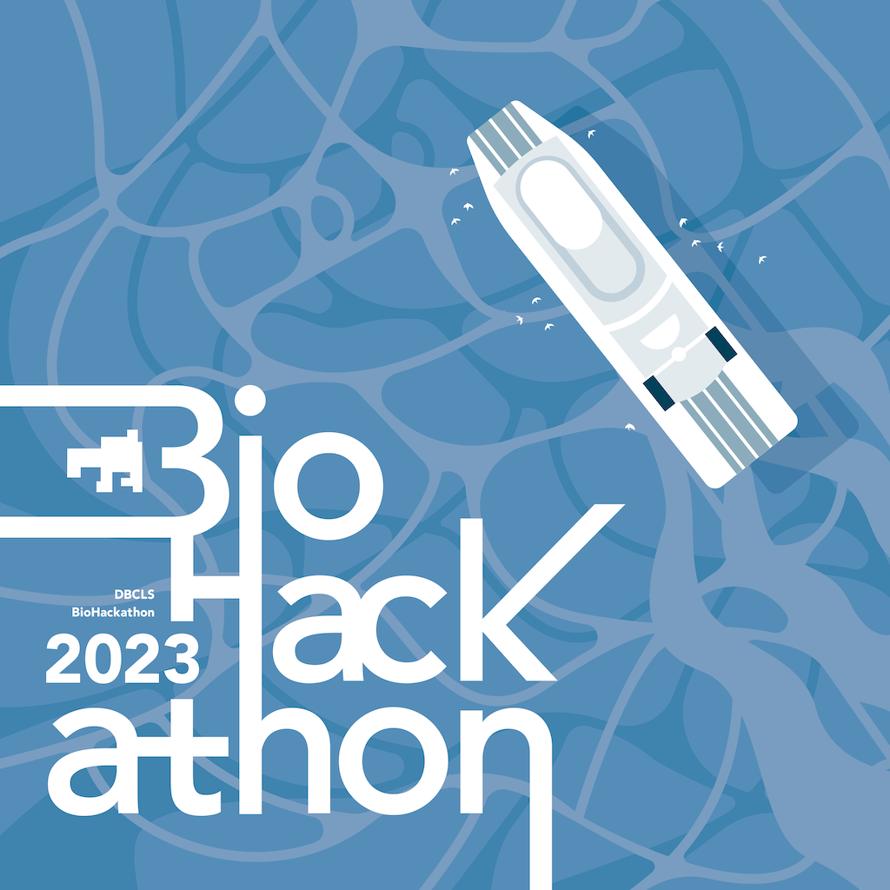

# DBCLS BioHackathon 2023

25th June - 1st July 2023 at the [Kagawa International Conference Hall](https://goo.gl/maps/FsFJxqnD2y2ujxPw5) in Takamatsu and [Olivean Shodoshima](https://olivean.com/) in Shodoshima island, Kagawa, Japan

- [Call for participation](/call)
- [Projects](/projects)
- [Schedule](/schedule)

<!--
## Goals

DBCLS BioHackathon

## History of BioHackathon

A long time ago in a galaxy far, far away..
-->

## Links

- [DBCLS](https://dbcls.rois.ac.jp/)
- [Past BioHackathons](http://biohackathon.org/)
- [BioHackathon Europe](https://biohackathon-europe.org/)
- [BioHackathon-MENA](https://github.com/biohackathon-mena)
- [BioHackathons in the US](https://biohackathons.github.io/)
